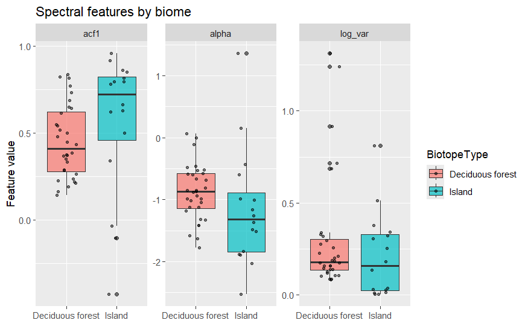

```{r}
#| label: do this first
#| echo: false
#| message: false

here::i_am("site/math-437-project-template.qmd")
```

## Summary

We wrangle a dataset from the Global Population Dynamics Database, construct a pipeline including PCA and a logistic classification model to test whether habitats have a "spectral fingerprint" which can be meaningfully measured from noisy population data, or if the fluctuation noise profile is consistent across habitats. We produced a predictive model which can predict whether spectral features belong to a deciduous forest or island biotope, which performed with .86 ROC_AUC after 5-fold cross-validation on a training set, and .8 accuracy on the holdout. The dataset this model was trained on was restricted to control for the effect of taxon on spectral features, implying there is some habitat-related signal present in population noise which can be used to predict habitat more consistently than a random guess, but our pipeline filters out too much data to say so with confidence; the pipeline is modular and will easily accommodate further testing, however.



## Motivation and Context


This section describes what you are investigating in your project and why you are investigating it. You should provide enough contextual background and information that someone with a limited background can understand the broad outlines of the topic being investigated.

Population data is difficult to sample. To complicate things further, population dynamics are chaotic and may fluctuate wildly within each sampling window, producing noisy data. This motivates analyzing population data by its variance instead of its first-order statistics.

The natural object of interest when studying variance of timeseries is the power spectrum, which uses the discrete Fourier transform to decouple the timeseries into a sum of periodic signals with different amplitudes and frequencies. Many ecologists have employed this method and found mysterious results; the importance of each frequency seems to naturally decay like the reciprocal of frequency, which is the spectral description of "pink noise".

The ubiquity of pink noise is not well-understood; many hypotheses exist, but none are broadly accepted, and few are even falsifiable. The goal of this paper is not to rehash those arguments. The goal is to simply create a dataset we can use to study and test these hypotheses, and for the purposes of this paper, we aim to identify the biotope a population exists in purely from the variance in its population, as measured by the spectrum of its timeseries.

## Packages Used In This Analysis


```{r}
#| label: load packages
#| message: false
#| warning: false

library(here)
library(readr)
library(dplyr)
library(ggplot2)
library(rsample)
library(tidyr)

library(tidymodels)

```


| Package | Use |
|--------------------------------|----------------------------------------|
| [here](https://github.com/jennybc/here_here) | to easily load and save data |
| [readr](https://readr.tidyverse.org/) | to import the CSV file data |
| [dplyr](https://dplyr.tidyverse.org/) | to massage and summarize data |
| [rsample](https://rsample.tidymodels.org/) | to split data into training and test sets |
| [ggplot2](https://ggplot2.tidyverse.org/) | to create nice-looking and informative graphs |
| [tidyr](https://tidyr.tidyverse.org/) | to access pivot_longer to wrangle a data frame |
| [tidymodels](https://tidymodels.tidyverse.org/) | to build a logistic prediction model |

## Data Description


```{r}
#| label: import data
#| warning: false

popdata <- readr::read_csv(here::here("site/gpdd/data/df35b.233.1-DATA.csv"), show_col_types = FALSE)

head(popdata)
names(popdata)

# the "main" dataframe lets us match the different dataframes by row, it tells us which IDs correspond

main <- readr::read_csv(here::here("site/gpdd/data/df35b.234.1-DATA.csv"), show_col_types = FALSE)

head(main)
names(main)

# this gives us information about the taxa, specifically for our purposes it lets us control "bird dynamics vs. insect dynamics" and other such things as confounding variables

taxon <- readr::read_csv(here::here("site/gpdd/data/df35b.236.1-DATA.csv"), show_col_types = FALSE)

head(taxon)
names(taxon)

#we need mainID and biotopeID

# this gives us information about the biotope, which lets us control "forest vs. tundra dynamics" and other such things as confounding variables

biotope <- readr::read_csv(here::here("site/gpdd/data/df35b.238.1-DATA.csv"), show_col_types = FALSE)

head(biotope)
names(biotope)

# This gives us the specific geographical location where the population was studied-- though we did not end up using it! 

location <- readr::read_csv(here::here("site/gpdd/data/df35b.239.1-DATA.csv"), show_col_types = FALSE)

head(location)
names(location)

```

## Data Wrangling


```{r}

series_lengths <- popdata |> group_by(MainID) |> summarise(SeriesLength = n())


summary(series_lengths)


```
Timeseries with especially short lengths should be filtered out, since we have 5000 or so to work with anyway. We can also filter for more reliable datasets using the column in main created by the GPDD compilers. But something more subtle:

```{r}

unique(main$SourceTransform)

```
This is a problem: population numbers cannot be interpreted directly. They all reflect a different type of measurement!

```{r}

table((main$SourceTransform))

```

There are 3525 with the "None" source transform, which should be enough. According to the codebook, these are raw numbers which should be compatible for our analysis, though we could always back-transform the other data later. For now, we can create a cleaned version of the main dataset

```{r}

main_clean <- main |>
  left_join(series_lengths, by = "MainID") |>
  filter(SourceTransform == "None",
         Reliability >= 3,
         SeriesLength >= 32,
         !is.na(BiotopeID))

```

And we can link the remaining IDs in the clean dataset using dplyr

```{r}


temp <- main_clean |>
  left_join(biotope, by = "BiotopeID") |>
  left_join(taxon,    by = "TaxonID") |>
  left_join(location, by = "LocationID")


gpdd_data <- popdata |> inner_join(temp, by = "MainID")


#Relevant variables to calculate features for analysis
gpdd <- gpdd_data |> select(MainID, Population, BiotopeID, BiotopeType, TaxonID, TaxonomicClass, CommonName, Reliability, SamplingUnits, SeriesLength, SeriesStep)


```

We noticed, however, many timeseries contain at least one gap. This is a problem for calculating the frequencies in each series spectrum, 

```{r}

gap_summary <- gpdd |>
  group_by(MainID) |>
  summarise(span = max(SeriesStep) - min(SeriesStep) + 1, actual_obs = n(), gap_pct = 1 - actual_obs / span)

hist(gap_summary$gap_pct, breaks = 50)
quantile(gap_summary$gap_pct, c(0.25, 0.5, 0.75))

```

In fact, the median timeseries is nearly half missing data! This is not going to work, so we need to filter again. We can remove all timeseries where more than half the data is missing.

We could try to filter further, but we need to be careful we do not lose so much data the various biotopes and taxa are unrepresented in our training data. We should check which biotopes are represented at each level of filtering.

```{r}

for (cut in c(0.1, 0.25, 0.5)) {
  ids <- gap_summary |> filter(gap_pct < cut) |> pull(MainID)
  cat("Gap cutoff", cut, ":", length(ids), "series\n")
  print(gpdd |> filter(MainID %in% ids) |> distinct(MainID, BiotopeType) |> count(BiotopeType, sort = TRUE) |> head(10))
  cat("\n")
}

```

Interestingly, it seems Aerial population data is the main thing we lose by removing all timeseries from our dataset with more than half the data missing. We do not have an explanation for why so many Aerial timeseries have missing data, but it is a natural choice to produce a gap cutoff at 0.25, since we only lose data from a single class.

For now, we will aim to restrict our analysis to only timeseries with more than 10 instances of their biotope in the dataset, so we can have enough data within each class to do a train/test split.

```{r}

clean_ids <- gap_summary |> filter(gap_pct < 0.25) |> pull(MainID)

gpdd_clean <- gpdd |> filter(MainID %in% clean_ids)


viable_biomes <- gpdd_clean |>
  distinct(MainID, BiotopeType) |>
  count(BiotopeType) |>
  filter(n >= 10) |>
  pull(BiotopeType)

gpdd_clean <- gpdd_clean |> filter(BiotopeType %in% viable_biomes)

```

```{r}
summary(gpdd_clean)
```

We previously handled gaps in time series, but many series in the dataset also have 0 entries naturally, which will be bad for our training. The GPDD codebook explains these are not sentinel variables, they just come from populations with prolonged periods of inactivity where rare spikes occur infrequently, like cicadas. These mostly 0 series will distort our data, so we will filter only for timeseries where less than half of the data is zero.

```{r}
zeros <- gpdd_clean |>
  group_by(MainID) |>
  summarise(nonzero_pct = mean(Population > 0))

dense_ids <- zeros |> filter(nonzero_pct >= 0.5) |> pull(MainID)

gpdd_clean <- gpdd_clean |> filter(MainID %in% dense_ids)
summary(gpdd_clean)
```

We now have a dataset with adequate representation across four biotopes, which should be enough for a simple classification model.

```{r}
gpdd_clean |> distinct(MainID, BiotopeType) |> count(BiotopeType, sort = TRUE)
```

However, one more confounding variable to consider: taxon. We want to conduct tests which minimize confounding between species and biotope, so we want to be sure taxa are represented similarly across our four biotopes.

```{r}

gpdd_clean |>
  distinct(MainID, BiotopeType, TaxonomicClass) |>
  count(BiotopeType, TaxonomicClass) |>
  ggplot(aes(x = BiotopeType, y = n, fill = TaxonomicClass)) +
  geom_col(position = "fill") +
  coord_flip() +
  labs(x = NULL, y = "Proportion", fill = "Taxonomic class",
       title = "Taxonomic composition by biome")

```

It is noteworthy that our filtering seems to have removed almost all diversity of taxa from the biotopes, other than in the marine biotope, where many different taxa survived. That is likely because we filtered the results against gaps and reliability, and marine population data is more often reliable and consistent, since there are major industries which regularly produce data on such things; the fishing industry and oil industry both fund environmental studies, for example, which likely produces more consistent reports across taxa than populations of insects in deciduous forests, or other populations we filtered out inadvertantly.

It appears taxa will massively confound our results, since our four biotopes' effect on population variance will be inseparable from the effect of taxon on variance! Fortunately, since the island and forest biotopes contain mostly birds apparently, we can restrict our analysis to these two datasets for now. 

```{r}

forest_island <- gpdd_clean |> filter(BiotopeType %in% c("Deciduous forest", "Island"))

forest_island |> distinct(BiotopeType)
```

```{r}
summary(forest_island)
```

Now we convert this to features we can analyze. R has a built-in function for handling the periodogram, so we need to write a function which takes in a time series, imputes the missing data, and returns a "row"-- for when we construct the feature dataset.

We assume each time series $f$ has a spectrum $S(f)$ which can be written as

$$
S(f) \approx C \cdot f^{-\alpha}
$$

$\alpha$ measures the rate at which frequencies in the spectrum decay in amplitude. If we linearize,

$$
\log S(f) \approx \log (C) -\alpha \log(f)
$$

So, we can calculate the spectral exponent $\alpha$ using a linear regression on the log-transformed spectrum.

This step was more difficult than anticipated, to be honest. There are tunable decisions and other assumptions made for the sake of an easier calculation, such as the buffer in the log step or the decision to calculate autocorrelation with a lag of 1. For our purposes, of creating a temporary features dataset for classification, any error introduced by arbitrary decisions in the function body is hopefully irrelevant to the exploration of whether information about biotope is preserved in population variance.

```{r}

#a function which takes in a timeseries and returns statistics about its spectrum

compute_features <- function(series_df) {
  
  # we want to order and separate the time steps and population to interpolate missing data
  series_df <- series_df[order(series_df$SeriesStep), ]
  steps <- series_df$SeriesStep
  pop <- series_df$Population
  
  # create a vector containing all steps and use approx to reshape the series, just using linear interpolation
  full_grid <- min(steps):max(steps)
  pop_filled <- approx(steps, pop, xout = full_grid)$y
  
  #we can shift slightly to avoid zero errors since the log of 0 is undefined. should not affect second-order statistics
  y <- log(pop_filled + 1)
  
  # detrend; we only care about variance
  y <- residuals(lm(y ~ seq_along(y)))
  
  n <- length(y)
  
  # R's built-in periodogram function 
  pgram <- spec.pgram(y, plot = FALSE, taper = 0.1, detrend = FALSE)
  freq <- pgram$freq
  spec <- pgram$spec
  
  # the most standard spectral statistic is the spectral exponent, alpha, which we can calculate in the manner discussed
  fit <- lm(log(spec) ~ log(freq))
  alpha <- coef(fit)[2]
  
  # the row to return (R returns automatically at the end of the function body)
  
  tibble(
    MainID      = series_df$MainID[1],
    BiotopeType = series_df$BiotopeType[1],
    log_var     = var(y), # variance of log-population, standard ecology statistic
    acf1        = cor(y[-n], y[-1]), #autocorrelation is the amount of information preserved formula for a standard spectral statistic
    alpha       = alpha, #spectral exponent
    n_obs       = n
  )
}

series_list  <- split(forest_island, forest_island$MainID)
features_list <- lapply(series_list, compute_features)
features     <- bind_rows(features_list)

```

```{r}
summary(features)
```

Now we have three predictors and a class in time-independent data, and we can finally perform machine learning.


## Exploratory Data Analysis

Before performing any learning, it would be prudent to make check distribution of features across each class. A box plot for each statistic should be fine.

```{r}


features |>
  pivot_longer(c(log_var, acf1, alpha), 
               names_to = "feature", 
               values_to = "value") |>
  ggplot(aes(x = BiotopeType, y = value, fill = BiotopeType)) +
  geom_boxplot(alpha = 0.7) +
  geom_jitter(width = 0.2, alpha = 0.5, size = 1) +
  facet_wrap(~feature, scales = "free_y") +
  labs(x = NULL, y = "Feature value",
       title = "Spectral features by biome")
```

From the graphs, it appears the island class has higher median autocorrelation (1 being perfectly preserved signal) and the deciduous forest class has higher alpha. Most importantly, the points are clustered well enough around the median that they should have some predictive power for each class.


## Modeling


We now perform principal component analysis, to find a natural basis for these features and interpret them.

```{r}


#normalize first
features_scaled <- features |>
  select(log_var, acf1, alpha) |>
  scale()

pca_result <- prcomp(features_scaled, center = FALSE, scale. = FALSE)

summary(pca_result)         
pca_result$rotation         


pc_data <- as.data.frame(pca_result$x) |>
  mutate(BiotopeType = features$BiotopeType)

biplot(pca_result)

```

The proportion of variance explained by PC3 is less than .04, so we can use PC1 and PC2 to understand the data without losing much information. Two principal components is the natural choice, then.

The biplot shows most of the data varies along the alpha-acf1 direction, and log_var is perpendicular to that direction. This implies variance of the log-population and alpha/acf1 are approximately independent, i.e. they share no information and are therefore orthogonal. alpha and acf1 pointing in nearly opposite directions implies there's a strong relationship between them, i.e. they are measuring the same information about the data in some way.

PC1 has higher loadings in this direction, implying PC1 is the "frequency component". It encodes how the spectra differ between the series.

PC2 has a higher loading in the perpendicular log variance direction. This implies PC2 is the "population component", measuring the magnitude of how the variance actually affects population count.


The loadings PC1 and PC2 give to alpha and acf1 are about equal and opposite, implying they share a lot of information. This is also shown in the biplot, where these variables are approximately colinear and opposite. In hindsight, this was predictable from known relationships in spectrum analysis. We really do not need to consider both since they share all information, so we should only use one or the other in our predictive modeling section.

```{r}

#add a column to the principal component data encoding biotope type
pc_data <- as.data.frame(pca_result$x) |>
  mutate(BiotopeType = features$BiotopeType)

#we want a scatterplot, where the colors are different for each class.
ggplot(pc_data, aes(x = PC1, y = PC2, color = BiotopeType)) +
  geom_point(size = 2.5, alpha = 0.7) +
  labs(title = "PC scores by biome")

```
The two datasets seem to occupy noticeably different regions in principal component space, which should imply there is enough meaningful distinction between classes in the datasets for a predictive model to be possible.

First, we need a train-test split:

```{r}

set.seed(211)

features_split <- initial_split(
  data = features,
  prop = 0.80
  
)

features_train <- training(features_split)
features_test <- testing(features_split)
```

The standard method for binary classification problems is the logistic regression. We can capture higher-order relationships between the classes and predictors by adding a polynomial degree parameter, though we should tune it to make sure we are actually getting a useful result. We do not want to try huge values for the degree since it gets unwieldy quickly, and we want a model with as few parameters as possible.

Our dataset is too small to support higher-degree polynomial fits, so we will just tune between degree 1 and degree 2.

Since we discovered the colinearity of alpha and autocorrelation, we should only train on autocorrelation, since it is more directly interpretable (how signal is preserved in the population data, i.e. how consistently predictive of the population's trajectory its current state is) and equivalent to alpha.

```{r}

cv_folds <- vfold_cv(features_train, v = 5, strata = BiotopeType)

features_wflow <- workflow()

features_model <- logistic_reg(
  mode = "classification",
  engine= "glm"
)

features_recipe <- recipe(
  BiotopeType ~ acf1 + log_var,
  data = features_train
) |> step_normalize(all_numeric_predictors()) |>
  step_poly(all_numeric_predictors(), degree = tune())

features_wflow <- features_wflow |>
  add_model(features_model) |>
  add_recipe(features_recipe)

poly_grid <- expand.grid(degree = 1:2)

log_results <- tune_grid(features_wflow, resamples = cv_folds, grid = poly_grid)

```

```{r}

autoplot(log_results)

collect_metrics(log_results)

best_degree <- select_by_one_std_err(log_results, metric = "accuracy", degree)

```

The ROC_AUC for the linear fit is .43, while the null model has ROC_AUC of .5. This suggests the relationship between the probability of belonging to an Island or Forest biotope and its spectral features is highly nonlinear, which also explains why the quadratic fit outperforms the linear fit and the null model, with an ROC_AUC of .86. That suggests the model performs well on the training data at least, but there is a real risk of overfitting. We have to see how it performs on the test set.

```{r}

features_wflow <- finalize_workflow(features_wflow, best_degree)

features_fit <- features_wflow |> fit(data = features)

features_pred <- features_fit |>
  augment(new_data = features_test)

features_pred$BiotopeType <- as.factor(features_pred$BiotopeType)

features_pred |>
  conf_mat(
    truth = BiotopeType,
    estimate = .pred_class
  ) -> fv_conf_mat

fv_conf_mat

```

The model successfully predicted 8 out of 10 test labels, which is consistent with its performance on the training set, which in theory suggests overfitting was not an issue. However, the test set is small enough sampling variance might be creating the illusion of a robust model, so we should not overinterpret the result.

## Insights

The logistic model appears to suggest a meaningful classification at 10% significance (compared to the null classifier which guesses correctly with probability .5, which allows us to construct a binomial null distribution to test against), but this should not be taken at face value when so much more data is available in the GPDD, and we should have decided a significance level before calculating the result to be intellectually honest, anyway. If anything, this should be seen as a proof of concept, narrowly applying the idea of predicting environment from spectral features across bird populations. Standard ecological theory would suggest this is possible, and we now have a weak result on a small subset of the data, so the next logical step would be to introduce more data and see if the findings are robust, not to formalize this as a hypothesis test. Our work constructs a pipeline which can be easily modified and extended to accommodate better tests.

### Limitations and Future Work


The pipeline is solid but massive amounts of data were left out from the analysis. Earlier we filtered to only data that was originally reported as raw counts, but we can easily back-transform the other reporting types and conduct the same test on a larger dataset. We could also use reliability as a predictor instead of filtering it out entirely. The main problem with our model is how little data is in the holdout set to verify it. Also, the distribution of classes in the training set is unequal, which makes the null prediction of "guess the majority class" competitive with the predictive model and implies we need to adjust our testing method. Filtering the data better would allow us to do the same test but properly stratified. 

Also, we could consider taxonomic data instead of filtering it out entirely, though we need to be careful the results do not confound ours. We can filter differently to produce datasets that align by taxa but have different biotopes, and examine if predictive models consistently perform at the .86 ROC_AUC level the logistic model performs at, to see if the result is robust or a consequence of a small training dataset.

Once that is figured out, we can construct an actual hypothesis test; we are interested in whether the classification model outperforms a model that guesses the majority class in the dataset, which is a routine hypothesis test for a classification model. That test should provide statistical evidence of whether habitats possess characteristic population noise, or whether population noise dynamics are robust across habitats.

Finally, it is important to consider the innate assumption Fourier spectrum analysis makes on timeseries with many variables, which is stationarity. Real-world data is rarely drawn from stationary distributions, but our implementation of the spectral analysis assumes stationarity in the noise profiles of each series, or at least relaxed stationarity (stationarity within the window of each time series). This is a common issue for spectral analysis, which can be handled by either partitioning the time series and computing features within each partition, or by using complicated multifractal analysis methods, such as wavelet analysis. These are beyond the scope of our current analysis, but if one questions the stationarity assumption, these are the methods which can address that. We can reasonably assume stationarity does not affect our core concern, which is whether predictive models can outperform the null model, i.e. whether habitat signal is preserved in some form in the population noise; even if the noise is not drawn from a stationary distribution, if the change in that distribution over time carries some habitat signal, our method should still produce a classification model which outperforms the null, even if our spectral analysis represents a blurry averaged version of the population's actual noise profile.
